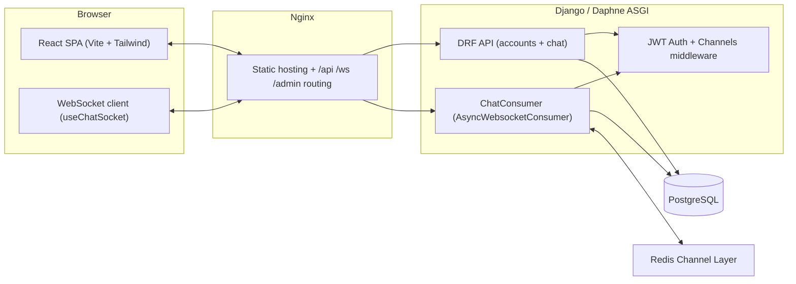
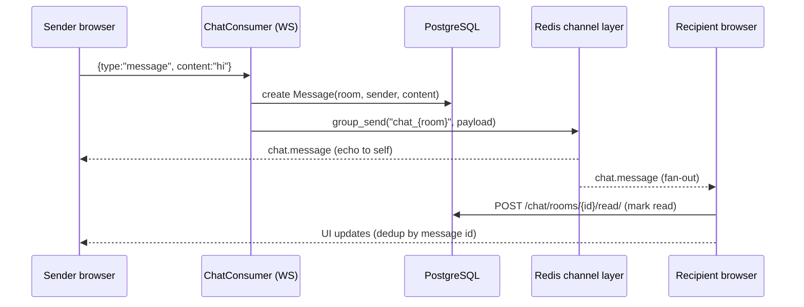

<div align="center">

# ⚡ Pulse — Real-Time Chat Application

**A full-stack, Dockerized, Kubernetes-deployed chat platform with WebSocket messaging, JWT auth, typing indicators, and live presence.**

[]()
[]()
[]()
[]()
[]()
[]()
[]()
[]()

**Python · JavaScript (React) · Django · Django REST Framework · Channels · Redis · PostgreSQL · React · Vite · Tailwind CSS · Docker · Kubernetes · Jenkins**

</div>

---

## Table of Contents

- [Overview](#overview)
- [Features](#features)
- [Screenshots](#screenshots--demo)
- [Configuration](#configuration)
- [Tech Stack](#tech-stack)
- [Requirements](#requirements)
- [Installation & Setup](#installation--setup)
- [How It Works](#how-it-works)
- [API Reference](#api-reference)
- [Project Structure](#project-structure)
- [CI/CD & Deployment](#cicd--deployment)
- [Contribution](#contribution)
- [License](#license)
- [Author & Credits](#author--credits)

---

## Overview

Pulse is a real-time chat application built to demonstrate a production-grade full-stack architecture. It delivers **instant messaging over WebSockets**, secure **JWT-based authentication**, **one-to-one and group conversations**, **typing indicators**, **online presence**, and **read receipts** — wrapped in a polished, responsive React UI.

The project is designed to be exactly what a recruiter wants from a portfolio backend: a real distributed system with

- an **ASGI server** (Daphne) handling HTTP + WebSocket traffic side by side,
- a **Redis channel layer** fanning messages out across multiple workers,
- a **PostgreSQL** datamodel with UUID primary keys and many-to-many rooms,
- a **Jenkins → Docker → Kubernetes** delivery pipeline that ships it to a live cluster with dynamic `nip.io` hostnames.

> 🎯 **Problem:** most chat tutorials stop at a socket echo server. Pulse goes further — real persistence, auth, presence, grouping, and a fully automated deploy path.
>
> ✅ **Solution:** a containerized full stack whose every layer (data model, async messaging, auth, CI/CD) mirrors how production chat systems are actually built.

---

## Features

| Feature | What it does | Why it matters |
| --- | --- | --- |
| 💬 **Real-time messaging** | Messages persist to PostgreSQL, then broadcast to every room member over WebSockets | Multi-client instant delivery via a Redis channel layer |
| 👤 **JWT authentication** | Access token (12h) + rotating refresh token (7d) via SimpleJWT | Stateless auth; axios interceptors auto-refresh on 401 |
| 🔒 **WebSocket auth** | Custom Channels middleware validates the JWT from `?token=` on connect | No unauthenticated sockets; hosts are verified as room members |
| ✍️ **Typing indicators** | Broadcast on every keystroke, auto-expire after 3s | Mirrors real messenger UX |
| 🟢 **Online presence** | `is_online` / `last_seen` updated on connect/disconnect and broadcast to the room | Live "Online / Offline" status in the sidebar and header |
| ✅ **Read receipts** | `POST …/read/` marks others' messages read; unread dot on rooms with new activity | Unread states stay correct even while the room is open |
| 🔢 **Activity sorting** | Chat sidebar is sorted by most recent activity | Active conversations float to the top |
| 🔁 **Resilient sockets** | Frontend hook auto-reconnects with exponential backoff and refreshes stale JWTs | Survives network blips without manual reloads |
| 🏗️ **Dockerized stack** | Backend, frontend, PostgreSQL & Redis orchestrated via `docker-compose.yml` | One command local setup |
| ☸️ **Kubernetes + Jenkins** | Declarative pipeline builds images, pushes to Docker Hub, deploys to a K8s cluster | Continuous delivery to a real cluster with ingress routing |

---

## Screenshots / Demo

> 📸 Screenshots are not available yet. Add them here once you have them.

| Chat window | Room list | New conversation |
| --- | --- | --- |
|  |  |  |

---

## Configuration

All configuration lives in a single `.env` file at the repository root (see [`.env.example`](.env.example)). The backend reads it with `django-environ`; `docker-compose.yml` passes relevant values to each service.

| Variable | Default | Used by | Purpose |
| --- | --- | --- | --- |
| `DJANGO_SECRET_KEY` | — | backend | Django secret — **set a long random value in production** |
| `DEBUG` | `False` | backend | Django debug mode |
| `DJANGO_ALLOWED_HOSTS` | `*` | backend | Allowed HTTP hosts |
| `POSTGRES_DB` / `POSTGRES_USER` / `POSTGRES_PASSWORD` | `chatdb` / `chatuser` / `chatpass` | db + backend | PostgreSQL credentials |
| `POSTGRES_HOST` / `POSTGRES_PORT` | `db` / `5432` | backend | DB connection from the API |
| `REDIS_HOST` / `REDIS_PORT` | `redis` / `6379` | backend | Redis channel layer for WebSockets |
| `VITE_API_URL` | `http://localhost:8000/api` | frontend (baked in at build) | REST API base URL the browser calls |
| `VITE_WS_URL` | `ws://localhost:8000/ws` | frontend (baked in at build) | WebSocket endpoint |
| `CORS_ALLOWED_ORIGINS` / `CSRF_TRUSTED_ORIGINS` | `http://localhost:5173` | backend | Allowed browser origins |
| `DJANGO_SUPERUSER_*` | — | backend startup | Optional auto-created admin account |

---

## Tech Stack

### Backend — `backend/`

| Technology | Version | Purpose |
| --- | --- | --- |
| **Python / Django** | 3.12 / 5.0.7 | Core web framework, ORM, admin, migrations |
| **Django REST Framework** | 3.15.2 | REST API serializers & generic view classes |
| **SimpleJWT** | 5.3.1 | JWT access/refresh token auth |
| **Channels** | 4.1.0 | WebSocket layer & consumer framework |
| **channels-redis** | 4.2.0 | Redis channel layer (cross-worker fan-out) |
| **Daphne** | 4.1.2 | Production ASGI server (HTTP + WebSocket) |
| **PostgreSQL** (`psycopg2`) | 16 | Primary data store |
| **Redis** | 7 | Realtime message/group routing + presence state |

### Frontend — `frontend/`

| Technology | Version | Purpose |
| --- | --- | --- |
| **React** | 18.3.1 | UI framework |
| **Vite** | 5.3.1 | Build tool & dev server |
| **React Router** | 6.24 | Routing / protected routes |
| **Axios** | 1.7.2 | HTTP client with auth + refresh interceptors |
| **Tailwind CSS** | 3.4.4 | Styling |
| **date-fns / lucide-react** | 3.6 / 0.400 | Date formatting & icons |

### Infrastructure

| Piece | Detail |
| --- | --- |
| **Containers** | Multi-stage Dockerfiles — Node 20 build → Nginx 1.27 static host; Python 3.12 slim backend |
| **Orchestration** | `docker-compose.yml` for local; Kubernetes manifests under `k8s/` for prod |
| **CI/CD** | Declarative Jenkinsfile: build → push → deploy to a remote K8s node |
| **Ingress** | Nginx Ingress routes `/api`, `/ws`, `/admin` → backend, `/` → frontend |

---

## Requirements

| Tool | Version | Notes |
| --- | --- | --- |
| Python | 3.12+ | Backend |
| Node.js | 20+ | Frontend build |
| Docker & Docker Compose | ≥ 2.x | Recommended local setup |
| PostgreSQL 16 / Redis 7 | — | Hands-free in Docker |

---

## Installation & Setup

### Option A — Docker Compose (recommended)

```bash
git clone https://github.com/Mdskun/Real-Time-Chat-Application.git
cd Real-Time-Chat-Application

cp .env.example .env      # then edit DJANGO_SECRET_KEY & passwords
docker compose up --build
```

- Backend API → `http://localhost:8000` (Daphne: HTTP + WebSocket)
- Frontend → `http://localhost:5173`
- PostgreSQL 16 and Redis 7 start automatically with healthchecks.

> 💡 The template env uses `minu.local` hostnames. For localhost, set `VITE_API_URL=http://localhost:8000/api`, `VITE_WS_URL=ws://localhost:8000/ws`, and update `CORS_ALLOWED_ORIGINS`/`CSRF_TRUSTED_ORIGINS` to `http://localhost:5173` in `.env`.

### Option B — Manual (separate processes)

**Backend**

```bash
cd backend
python -m venv .venv && source .venv/bin/activate
pip install -r requirements.txt

export DJANGO_SECRET_KEY="change-me" POSTGRES_HOST=localhost \
       DJANGO_ALLOWED_HOSTS=localhost,127.0.0.1 DEBUG=True
python manage.py migrate
python manage.py createsuperuser          # optional admin
daphne -b 0.0.0.0 -p 8000 config.asgi:application
```

**Frontend**

```bash
cd frontend
npm install
VITE_API_URL=http://localhost:8000/api VITE_WS_URL=ws://localhost:8000/ws npm run dev
```

Then open `http://localhost:5173`, register an account, and start a conversation with the ➕ button.

---

## How It Works

### System architecture



The same **Daphne** process serves both REST requests and WebSockets, and every consumers instance talks through the shared **Redis channel layer** — so fan-out works identically whether you run one app or fifty replicas.

### Lifecycle of a message



1. **Send** — `MessageInput` → `useChatSocket.sendMessage()` pushes `{type:"message"}` up the socket.
2. **Persist** — `ChatConsumer.receive()` creates the `Message` row, serializes it, and does `group_send` to `chat_<room_id>`.
3. **Fan-out** — Redis delivers to every member's consumer, including the sender; each consumer forwards the frame to its browser.
4. **Render** — the recipient's `ChatWindow` dedups by message ID, auto-marks the room read (`POST …/read/`), and triggers a live sidebar refresh.

**Typing & presence** work the same way — `{type:"typing"}` and `presence.update` events are broadcast across the group, filtered so you don't see your own typing flag, with a 3s auto-clear timeout.

### Security model

- Every REST endpoint requires a valid JWT (`IsAuthenticated` default).
- WebSocket connects are rejected with close code **4001** (unauthenticated) or **4003** (not a room member) — non-members can never join a room group or observe its presence/typing traffic.
- Room creation validates participant IDs server-side (valid UUIDs, existing users, self-IDs stripped, DMs restricted to exactly one other user) and dedupes direct-message rooms atomically.
- Secrets are never committed — `k8s/02-secrets.yaml` holds placeholders; real values are injected by Jenkins at deploy time.

---

## API Reference

Base URL: `/api`

### Auth — `accounts`

| Method | Endpoint | Description |
| --- | --- | --- |
| `POST` | `/auth/register/` | Create a user (username, email, password) |
| `POST` | `/auth/login/` | Get JWT access + refresh tokens (returns user payload) |
| `POST` | `/auth/refresh/` | Rotate refresh token for a new access token |
| `GET` | `/auth/me/` | Current user profile |
| `GET` | `/auth/users/` | All users (for starting conversations) |

### Chat — `chat`

| Method | Endpoint | Description |
| --- | --- | --- |
| `GET` | `/chat/rooms/` | List the caller's rooms (participants, last message) |
| `POST` | `/chat/rooms/` | Create a DM (`participant_ids:[id]`, `is_group:false`) or group |
| `GET` | `/chat/rooms/{uuid}/` | Room detail |
| `GET` | `/chat/rooms/{uuid}/messages/` | Message history |
| `POST` | `/chat/rooms/{uuid}/read/` | Mark others' messages as read |

### WebSocket

```
ws://<host>/ws/chat/<room_id>/?token=<access_jwt>
```

| Frame type | Payload | Purpose |
| --- | --- | --- |
| `message` | `{type, content}` | Send a chat message |
| `typing` | `{type, is_typing}` | Broadcast typing state |
| `presence` | `{type, user, is_online}` | Presence updates (server → client) |

---

## Project Structure

```
Real-Time-Chat-Application
├── backend/                        # Django + Channels ASGI app
│   ├── config/
│   │   ├── settings.py             # Env-driven Django/DRF/JWT/channel-layer config
│   │   ├── asgi.py                 # Protocol router: HTTP + WebSocket
│   │   ├── urls.py                 # /api/auth, /api/chat, /admin
│   │   └── wsgi.py
│   ├── accounts/                   # Users, JWT auth
│   │   ├── models.py               # User: avatar, is_online, last_seen
│   │   ├── serializers.py          # User / Register / Custom JWT serializers
│   │   ├── views.py                # Register, Login, Me, User list
│   │   └── urls.py
│   ├── chat/                       # Rooms, messages, realtime
│   │   ├── consumers.py            # ChatConsumer: connect/presence/typing/message
│   │   ├── middleware.py           # JWT → scope["user"] for WebSockets
│   │   ├── models.py               # Room (UUID, M2M), Message (UUID, is_read)
│   │   ├── serializers.py          # Room + Message serializers
│   │   ├── views.py                # Room CRUD, messages, mark-read
│   │   ├── routing.py              # ws/chat/<room_id>/ route
│   │   └── urls.py
│   ├── Dockerfile                  # python:3.12-slim, runs via entrypoint.sh
│   ├── entrypoint.sh               # wait-for-db → migrate → collectstatic → daphne
│   └── requirements.txt
├── frontend/                       # React + Vite SPA
│   ├── src/
│   │   ├── api/axios.js            # Axios base + JWT refresh interceptors
│   │   ├── context/AuthContext.jsx # Auth state (login/register/logout)
│   │   ├── hooks/useChatSocket.js  # WS client w/ auto-reconnect + token refresh
│   │   ├── pages/                  # LoginPage, RegisterPage, ChatPage
│   │   └── components/             # ChatWindow, RoomList, MessageBubble,
│   │                               # MessageInput, TypingIndicator, NewChatModal, UserAvatar
│   ├── nginx.conf                  # SPA fallback + static cache rules
│   └── Dockerfile                  # Node 20 build → nginx:1.27 runtime
├── k8s/                            # Production manifests (namespace "realtime-chat")
│   ├── 00-namespace.yaml           # Namespace
│   ├── 01-configmap.yaml           # Non-secret config (hosts, DB, Redis)
│   ├── 02-secrets.yaml             # Placeholder secrets (real ones injected by CI)
│   ├── 10-postgres.yaml            # PostgreSQL 16 (1 replica, 2Gi PVC)
│   ├── 11-redis.yaml               # Redis
│   ├── 15-migrations.yaml          # One-shot DB migration Job (single runner)
│   ├── 20-backend.yaml             # Backend (2 replicas, probes, load-balanced)
│   ├── 21-frontend.yaml            # Frontend nginx (2 replicas)
│   └── 30-ingress.yaml             # /api, /ws, /admin → backend; / → frontend
├── Jenkinsfile                     # Declarative CI/CD pipeline
├── docker-compose.yml              # Backend + frontend + PostgreSQL + Redis
└── .env.example                    # Template environment
```

---

## CI/CD & Deployment

A declarative **Jenkinsfile** ships every push from commit to cluster:

1. **Resolve Chat Host** — fetches the build node's public IP and derives a `chat.<ip>.nip.io` hostname (no DNS setup, survives EC2 restarts).
2. **Build & Push Images** — builds `backend` and `frontend` images with the correct `VITE_API_URL` / `VITE_WS_URL` build args (matching the Dockerfile ARG names), pushes `latest` + `$BUILD_NUMBER` tags to Docker Hub.
3. **Deploy to K8s** — SSHs to the Kubernetes worker, applies manifests in dependency order (namespace → configmap → secrets → postgres → redis → backend → frontend → ingress), waits for rollouts, and fails loudly with logs on any hiccup.

Kubernetes specifics: 2 backend replicas (liveness/readiness probes, 100m/256Mi requests), 2 frontend replicas, a persistent `db` Deployment with 2Gi storage, a single-runner **migrations Job** (`k8s/15-migrations.yaml`) that applies schema changes once before the backend rollout, and an Nginx Ingress with long proxy timeouts (3600s) so WebSockets stay open.

---

## Contribution

Contributions are welcome! To keep things clean:

1. Fork the repo and create a feature branch.
2. Test your change locally (Docker Compose is fastest).
3. Open a pull request describing the problem it solves.

Questions, bug reports, and feature ideas belong in the [Issues](https://github.com/Mdskun/Real-Time-Chat-Application/issues) tab.

---

## License

The repository does not currently include a `LICENSE` file, so no license is specified. Contact the author if you intend to reuse the code.

---

## Author & Credits

Built by [@Mdskun](https://github.com/Mdskun). Mainly a full-stack & DevOps showcase — Django, Channels/Redis for realtime, React for the UI, and a Jenkins → Docker → Kubernetes pipeline for delivery.

<details>
<summary><b>📦 Key engineering highlights</b></summary>

- **ASGI concurrency** — one process serves REST and WebSockets; async consumers never block the DB (all queries via `database_sync_to_async`).
- **Channel-layer fan-out** — Redis decouples message routing from app replicas, enabling horizontal scaling.
- **Zero-config deploys** — nip.io host resolution + `chat.local` substitution means the same manifests work for local dev and live clusters.
- **Resilient clients** — JWT rotation, axios refresh queues, and socket backoff-reconnect keep the app usable across token expiry and network drops.

</details>